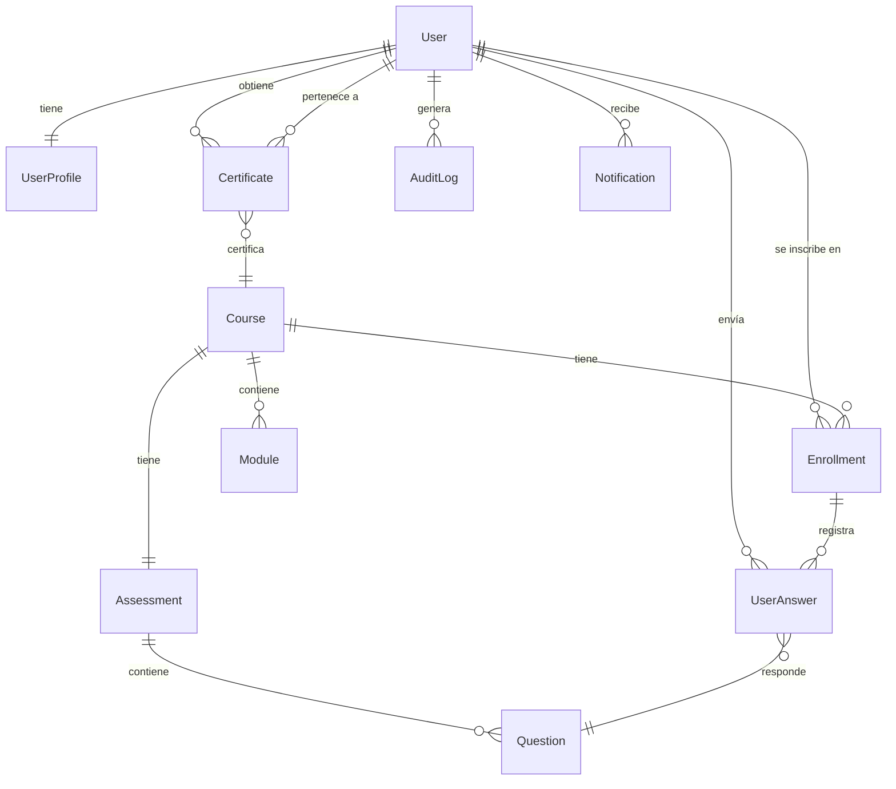

# SPEC.md — LMS Corporativo: Plataforma Interna de Capacitaciones

**Versión:** 1.0 | **Fecha:** 2026-06-08 | **Estado:** BORRADOR — Pendiente aprobación del cliente

---

## ÍNDICE

1. [Objetivo del sistema](#1-objetivo-del-sistema)
2. [Stack tecnológico y decisiones técnicas](#2-stack-tecnológico-y-decisiones-técnicas)
3. [Funcionalidades por fase](#3-funcionalidades-por-fase)
4. [Estructura del proyecto](#4-estructura-del-proyecto)
5. [Patrón arquitectónico backend](#5-patrón-arquitectónico-backend)
6. [Estilo de código y convenciones](#6-estilo-de-código-y-convenciones)
7. [Estrategia de pruebas](#7-estrategia-de-pruebas)
8. [Comandos del proyecto](#8-comandos-del-proyecto)
9. [Infraestructura Docker](#9-infraestructura-docker)
10. [Seguridad — requisitos no negociables](#10-seguridad--requisitos-no-negociables)
11. [Flujo de integración con IA](#11-flujo-de-integración-con-ia)
12. [Límites del sistema](#12-límites-del-sistema)
13. [Pantallas — mapeo completo (44 screens)](#13-pantallas--mapeo-completo-44-screens)
14. [Modelo de datos](#14-modelo-de-datos)
15. [Roles y permisos](#15-roles-y-permisos)
16. [Alertas de alcance](#16-alertas-de-alcance)

---

## 1. OBJETIVO DEL SISTEMA

### ¿Qué construimos?

Una plataforma LMS (Learning Management System) corporativa accesible desde el navegador. Los empleados toman cursos asignados, rinden evaluaciones y obtienen certificados digitales con código QR verificable. El diferenciador clave es la integración con IA (Anthropic Claude): los administradores suben sus materiales existentes (PDF, presentaciones) y el sistema genera automáticamente los módulos del curso y los cuestionarios de evaluación.

### Usuarios y roles

| Rol | Descripción |
|---|---|
| **ADMIN** | Acceso total. Gestiona usuarios, cursos, reportes y configuración del sistema. Puede cambiar roles de otros usuarios. |
| **TRAINER** | Crea y edita cursos, usa el generador IA de preguntas, ve reportes de su área. No gestiona usuarios ni ve el log de auditoría completo. |
| **USUARIO** | Toma cursos asignados a su grupo, rinde evaluaciones, descarga sus certificados. No accede a funciones de administración. |

### Valor de negocio

- Centraliza las capacitaciones obligatorias con trazabilidad completa para auditorías externas.
- Reduce el tiempo de creación de cursos: en lugar de construir el contenido desde cero, el administrador sube sus materiales y la IA genera una propuesta de estructura.
- Automatiza el seguimiento de cumplimiento: quién completó qué curso, cuándo y con qué nota.
- Genera certificados con UUID único verificable por terceros sin necesidad de autenticación.

---

## 2. STACK TECNOLÓGICO Y DECISIONES TÉCNICAS

### Backend

| Componente | Tecnología | Versión | Justificación |
|---|---|---|---|
| Framework web | Django + Django REST Framework | 5.x | Maduro, seguro, ORM robusto, migraciones nativas, excelente ecosistema para APIs |
| Autenticación | JWT (djangorestframework-simplejwt) | última | Tokens stateless; facilita la futura integración con Azure AD / SSO |
| Base de datos | PostgreSQL | 15+ | Relacional con soporte nativo de JSON para campos dinámicos (respuestas, opciones) |
| Tareas en background | Celery + Redis | última | Procesamiento asíncrono para análisis de archivos con IA; evita timeouts en peticiones HTTP |
| Generación de PDF | WeasyPrint | última | Convierte plantillas HTML+CSS a PDF; permite certificados con diseño corporativo |
| Análisis de documentos | pdfplumber (PDF) + python-pptx (PPT) | última | Extracción de texto para alimentar el contexto de la IA |
| Integración IA | Anthropic Python SDK — modelo claude-sonnet-4-6 | última | Generación de módulos de curso y preguntas desde contenido extraído |
| Bloqueo de cuentas | django-axes | última | Bloqueo automático tras 5 intentos fallidos; cumple requisito de seguridad |
| Rate limiting | django-ratelimit | última | Protección de endpoints de autenticación contra ataques de fuerza bruta |
| Email | Django Email Backend → SMTP Office 365 | — | Notificaciones con el servidor corporativo Microsoft 365 existente |
| Exportación Excel | openpyxl | última | Generación de reportes .xlsx y lectura de carga masiva de usuarios |

### Frontend

| Componente | Tecnología | Versión | Justificación |
|---|---|---|---|
| Framework | React + TypeScript | 18 / 5.x | TypeScript tipado fuerte reduce bugs en tiempo de desarrollo; ecosistema maduro |
| Build tool | Vite | última | Más rápido que Create React App; estándar actual de la industria |
| Estado global | **Zustand** | última | Menos código boilerplate que Redux Toolkit; más fácil de mantener; suficiente para este tamaño de aplicación |
| Routing | React Router v6 | última | Estándar para aplicaciones de página única (SPA) con React |
| HTTP client | Axios | última | Interceptores para renovación automática de tokens y manejo centralizado de errores |
| UI | Tailwind CSS + shadcn/ui | última | Componentes accesibles listos para usar; consistencia visual sin CSS personalizado complejo |
| Visualización | Recharts | última | Gráficos para el dashboard de reportes (Fase 2) |

### Infraestructura

| Componente | Tecnología | Justificación |
|---|---|---|
| Contenedores | Docker + Docker Compose | Ya instalado en el servidor; aísla dependencias; reproducible en cualquier entorno |
| Proxy reverso | Nginx | Sirve el frontend estático + redirige peticiones API a Django; gestiona SSL |
| Almacenamiento inicial | Volumen Docker local | Simple para MVP; la interfaz abstracta `StorageBackend` permite migrar a SharePoint sin cambiar la lógica de negocio |
| Message broker | Redis | Requerido por Celery para gestionar la cola de tareas de IA en background |

---

## 3. FUNCIONALIDADES POR FASE

### Fase 1 — MVP (Implementar primero)

| ID | Funcionalidad | Pantallas | Descripción |
|---|---|---|---|
| F-01 | Gestión de usuarios | P25–P29 | Creación individual y carga masiva por Excel (.xlsx/.csv). Hasta 500 usuarios, máx. 5 MB. Validación por fila con previsualización antes de importar. |
| F-02 | Autenticación segura | P01–P05 | Hash Argon2, bloqueo tras 5 intentos fallidos (15 min, contador visible), expiración de sesión a 30 min de inactividad, recuperación por código de 6 dígitos (expira en 30 min), cambio obligatorio en primer login. |
| F-03 | Gestión de cursos | P10–P16, P30–P35 | Cursos con o sin módulos, tipo obligatorio/opcional, fecha límite, versión, área responsable, audiencia por grupos. Contenido en 3 formatos MVP: Video URL embebida, PDF subido, Texto HTML enriquecido. |
| F-04 | Panel de usuario | P06–P09 | Dashboard con progreso por curso, semáforo de vencimiento (verde/amarillo/rojo), historial de actividad reciente y acceso a certificados propios. |
| F-05 | Evaluaciones | P17–P21 | Banco de preguntas configurable. Tipos: opción múltiple, selección múltiple, verdadero/falso. Puntaje mínimo, intentos y tiempo límite configurables. Guardado automático de respuestas. Historial completo por usuario. |
| **F-IA** | **Generador IA de contenido** | P34 | **Ver sección 11.** Análisis de archivos PDF/PPT subidos para generar módulos de curso. Generación de preguntas desde contenido existente. Supervisión humana obligatoria antes de guardar. |
| F-LOG | Log de auditoría | P39 | Registro inmutable de todas las acciones críticas (ver sección 10). |
| F-NOTIF | Notificaciones | P09, P40 | Alertas de sistema: nuevo curso asignado, vencimiento a 7 días, vencimiento a 1 día, curso vencido, examen aprobado/reprobado. |

### Fase 2 — Post MVP

| ID | Funcionalidad | Descripción |
|---|---|---|
| F-06 | Certificados PDF | Generación automática con UUID único, código QR, nombre del empleado, curso, nota, fecha y versión. URL de verificación pública sin autenticación. |
| F-08 | Reportes de cumplimiento | Dashboard con 7 gráficos. Reportes por curso, usuario y área. Exportación en Excel y PDF. |
| F-EMAIL | Notificaciones por email | Envío de correos para: nuevo curso asignado, vencimiento (7 días y 1 día), certificado disponible. Vía SMTP Office 365. |
| SCORM | Soporte SCORM | Módulos de tipo paquete SCORM 1.2 / 2004. |

### Fase 3 — Diferido

| ID | Funcionalidad | Descripción |
|---|---|---|
| F-09 | Integración SharePoint | Almacenamiento de archivos de contenido vía `SharePointStorage`. La interfaz abstracta ya estará implementada desde el MVP. |
| F-10 | Active Directory / Azure AD | SSO. La capa de autenticación se diseña desde el MVP con puntos de extensión claros para esta integración. |

---

## 4. ESTRUCTURA DEL PROYECTO

```
Plataforma_Capacitaciones/
│
├── backend/
│   ├── config/                          # Configuración central de Django
│   │   ├── settings/
│   │   │   ├── base.py                  # Configuración común a todos los entornos
│   │   │   ├── development.py           # DEBUG=True, logs detallados
│   │   │   └── production.py            # PostgreSQL, HTTPS, sin DEBUG
│   │   ├── urls.py                      # Enrutador principal de la API
│   │   ├── wsgi.py
│   │   └── celery.py                    # Configuración de Celery
│   │
│   ├── apps/
│   │   ├── authentication/              # Login, JWT, bloqueo, recuperación de contraseña
│   │   │   ├── models.py                # LoginAttempt (para rastrear intentos)
│   │   │   ├── services.py              # Lógica: autenticar, bloquear, recuperar
│   │   │   ├── views.py                 # Solo recibe request, llama service
│   │   │   └── serializers.py           # Validación de datos de entrada
│   │   │
│   │   ├── users/                       # Usuarios, perfiles, carga masiva
│   │   │   ├── models.py                # User (extiende AbstractUser), UserProfile
│   │   │   ├── services.py              # Crear usuario, importar Excel, cambiar rol
│   │   │   ├── views.py
│   │   │   └── serializers.py
│   │   │
│   │   ├── courses/                     # Cursos, módulos, inscripciones
│   │   │   ├── models.py                # Course, Module, Enrollment
│   │   │   ├── services.py              # Crear curso, publicar, inscribir usuarios
│   │   │   ├── views.py
│   │   │   └── serializers.py
│   │   │
│   │   ├── assessments/                 # Evaluaciones, preguntas, respuestas
│   │   │   ├── models.py                # Assessment, Question, UserAnswer
│   │   │   ├── services.py              # Calificar intento, guardar respuestas
│   │   │   ├── views.py
│   │   │   └── serializers.py
│   │   │
│   │   ├── certificates/                # Generación PDF, UUID, QR (Fase 2)
│   │   │   ├── models.py                # Certificate
│   │   │   ├── services.py              # Generar PDF, verificar por UUID
│   │   │   ├── views.py
│   │   │   └── serializers.py
│   │   │
│   │   ├── notifications/               # Notificaciones del sistema
│   │   │   ├── models.py                # Notification
│   │   │   ├── services.py              # Crear y enviar notificaciones
│   │   │   └── tasks.py                 # Tareas Celery: emails, alertas programadas
│   │   │
│   │   ├── reports/                     # Reportes y auditoría (Fase 2 + log MVP)
│   │   │   ├── models.py                # AuditLog
│   │   │   ├── services.py              # Generar reportes, exportar Excel/PDF
│   │   │   └── views.py
│   │   │
│   │   └── ai_generator/               # Integración Anthropic Claude
│   │       ├── services.py              # Llamadas a Claude API, extracción de texto
│   │       ├── tasks.py                 # Tarea Celery: análisis asíncrono de archivos
│   │       └── parsers.py               # pdfplumber + python-pptx: extracción de texto
│   │
│   ├── storage/                         # Capa de abstracción de almacenamiento
│   │   ├── backends/
│   │   │   ├── base.py                  # Clase abstracta StorageBackend
│   │   │   ├── local.py                 # MVP: volumen Docker local
│   │   │   └── sharepoint.py            # Fase 3: stub con interfaz definida
│   │   └── __init__.py
│   │
│   ├── requirements/
│   │   ├── base.txt                     # Dependencias comunes
│   │   ├── development.txt              # + herramientas de desarrollo
│   │   └── production.txt               # + gunicorn, sin herramientas de debug
│   │
│   ├── manage.py
│   └── Dockerfile
│
├── frontend/
│   ├── src/
│   │   ├── pages/                       # 44 pantallas organizadas por módulo
│   │   │   ├── auth/                    # P01–P05: Login, recuperación, bloqueo
│   │   │   ├── dashboard/               # P06–P09: Panel usuario, perfil, notificaciones
│   │   │   ├── courses/                 # P10–P16: Catálogo, reproductores, completado
│   │   │   ├── assessments/             # P17–P21: Intro, preguntas, resultados
│   │   │   ├── certificates/            # P22–P24: Galería, modal, verificación pública
│   │   │   ├── admin/
│   │   │   │   ├── users/               # P25–P29: Gestión de usuarios
│   │   │   │   ├── courses/             # P30–P35: Crear cursos, generador IA
│   │   │   │   └── reports/             # P36–P39: Dashboard reportes, log auditoría
│   │   │   └── errors/                  # P41–P44: 404, 403, 500, mantenimiento
│   │   │
│   │   ├── components/
│   │   │   ├── ui/                      # Wrappers de shadcn/ui
│   │   │   ├── layout/                  # AppLayout, Navbar, Sidebar
│   │   │   └── shared/                  # DataTable, Modal, Badge, LoadingSpinner
│   │   │
│   │   ├── store/                       # Zustand stores (un store por dominio)
│   │   │   ├── authStore.ts             # Usuario autenticado, token
│   │   │   ├── coursesStore.ts          # Lista de cursos, curso activo
│   │   │   └── notificationsStore.ts    # Notificaciones no leídas
│   │   │
│   │   ├── services/                    # Capa de comunicación con la API
│   │   │   ├── api.ts                   # Instancia Axios con interceptores de auth
│   │   │   ├── authService.ts
│   │   │   ├── coursesService.ts
│   │   │   ├── assessmentsService.ts
│   │   │   ├── usersService.ts
│   │   │   └── aiService.ts
│   │   │
│   │   ├── types/                       # Interfaces TypeScript (espejo de modelos backend)
│   │   │   ├── user.ts
│   │   │   ├── course.ts
│   │   │   ├── assessment.ts
│   │   │   └── certificate.ts
│   │   │
│   │   ├── hooks/                       # Custom hooks de React
│   │   └── utils/                       # Helpers: formato de fechas, validaciones
│   │
│   ├── index.html
│   ├── package.json
│   ├── tsconfig.json
│   ├── vite.config.ts
│   └── Dockerfile
│
├── nginx/
│   └── nginx.conf                       # Proxy reverso + servir frontend estático
│
├── docker-compose.yml                   # Producción
├── docker-compose.dev.yml               # Desarrollo local
├── .env.example                         # Variables requeridas (sin valores reales)
└── SPEC.md
```

---

## 5. PATRÓN ARQUITECTÓNICO BACKEND

Cada aplicación Django sigue un patrón de 4 capas estricto y sin excepciones:

```
models.py       ← Define la estructura de datos y relaciones en la BD
     ↓
services.py     ← TODA la lógica de negocio vive aquí y solo aquí
     ↓
views.py        ← Recibe la petición HTTP, llama al service, retorna la respuesta
     ↓
serializers.py  ← Solo convierte datos entre JSON y objetos Python
```

**Reglas no negociables de esta arquitectura:**

- `views.py` nunca contiene lógica condicional de negocio. Solo orquesta.
- `serializers.py` no calcula nada. Solo valida formato y convierte tipos.
- `services.py` puede ser testeado de forma independiente sin levantar una petición HTTP.
- `models.py` solo tiene métodos que pertenecen al modelo (ej: `__str__`, propiedades calculadas simples).

---

## 6. ESTILO DE CÓDIGO Y CONVENCIONES

### Python / Django

- Seguir PEP 8 estrictamente
- Usar type hints en todas las funciones de `services.py`
- Código en inglés; mensajes visibles al usuario final en español
- Toda variable de entorno accedida con `os.environ.get()` o `django-environ`
- Nunca credenciales, API keys ni contraseñas en el código fuente

### TypeScript / React

- Modo estricto de TypeScript activado (`"strict": true` en `tsconfig.json`)
- Solo functional components (sin class components)
- Props tipadas con `interface`, no `type`, para componentes React
- Un Zustand store por dominio de negocio
- Toda llamada a la API va a través de `src/services/`; los componentes no llaman a `api.ts` directamente
- Sin lógica de negocio en componentes — delegar a custom hooks y services

### Convenciones de nombres

| Elemento | Convención | Ejemplo |
|---|---|---|
| Archivos Python | snake_case | `course_service.py` |
| Clases Python | PascalCase | `CourseService` |
| Archivos React | PascalCase | `CourseCard.tsx` |
| Componentes React | PascalCase | `<CourseCard />` |
| Zustand stores | camelCase con prefijo `use` | `useCoursesStore` |
| API endpoints | kebab-case con `/api/v1/` | `/api/v1/courses/` |
| Variables de entorno | UPPER_SNAKE_CASE | `ANTHROPIC_API_KEY` |

### Identificadores de requisitos

- Requisitos funcionales: `RF-[MÓDULO]-NN` (ej: `RF-AUTH-01`, `RF-CURSO-03`)
- Requisitos no funcionales: `RNF-[CATEGORÍA]-NN` (ej: `RNF-SEG-01`, `RNF-REND-02`)

---

## 7. ESTRATEGIA DE PRUEBAS

### Backend (pytest-django)

- **Pruebas unitarias**: La cobertura objetivo está en `services.py` de cada app
- **Pruebas de integración**: Endpoints de la API con `APITestCase` de DRF
- **Sin mocks de base de datos**: Todas las pruebas usan una base de datos de test real (PostgreSQL de test generada automáticamente por Django)
- Las tareas de Celery se prueban en modo `CELERY_TASK_ALWAYS_EAGER=True` durante tests

### Frontend (Vitest + React Testing Library)

- Pruebas unitarias para custom hooks críticos y funciones de utilidad
- Pruebas de componentes para formularios y flujos principales (login, examen)
- Sin pruebas E2E en el MVP — diferir a Fase 2

### Cobertura mínima para el MVP

| Módulo | Objetivo |
|---|---|
| `authentication/services.py` | 90% |
| `assessments/services.py` | 90% |
| `courses/services.py` | 80% |
| `ai_generator/services.py` | 70% |
| `users/services.py` | 80% |
| Componentes React críticos | 50% |

---

## 8. COMANDOS DEL PROYECTO

### Configuración inicial (primera vez)

```bash
# 1. Copiar variables de entorno
cp .env.example .env
# Editar .env con los valores reales (BD, API keys, email, etc.)

# 2. Levantar todos los servicios en modo desarrollo
docker-compose -f docker-compose.dev.yml up --build

# 3. Crear las tablas en la base de datos
docker-compose exec backend python manage.py migrate

# 4. Crear el primer usuario administrador
docker-compose exec backend python manage.py createsuperuser
```

### Desarrollo diario

```bash
# Levantar servicios
docker-compose -f docker-compose.dev.yml up

# Crear nuevas migraciones (después de modificar models.py)
docker-compose exec backend python manage.py makemigrations

# Aplicar migraciones
docker-compose exec backend python manage.py migrate

# Ejecutar tests del backend
docker-compose exec backend pytest

# Ejecutar tests con reporte de cobertura
docker-compose exec backend pytest --cov=apps --cov-report=term-missing

# Ver logs en tiempo real
docker-compose -f docker-compose.dev.yml logs -f backend
docker-compose -f docker-compose.dev.yml logs -f celery-worker
```

### Producción

```bash
# Build y despliegue
docker-compose up --build -d

# Ver estado de los servicios
docker-compose ps

# Ver logs
docker-compose logs -f backend

# Backup de la base de datos
docker-compose exec db pg_dump -U $POSTGRES_USER $POSTGRES_DB > backup_$(date +%F).sql

# Reinicar un servicio específico
docker-compose restart backend
```

### Variables de entorno requeridas (`.env.example`)

```env
# Django
SECRET_KEY=CAMBIAR_ESTO
DEBUG=False
ALLOWED_HOSTS=mi-servidor.empresa.com

# Base de datos (PostgreSQL existente)
DATABASE_URL=postgresql://usuario:contraseña@db:5432/lms_db

# IA (Anthropic)
ANTHROPIC_API_KEY=CAMBIAR_ESTO

# Email (Office 365)
EMAIL_BACKEND=django.core.mail.backends.smtp.EmailBackend
EMAIL_HOST=smtp.office365.com
EMAIL_PORT=587
EMAIL_USE_TLS=True
EMAIL_HOST_USER=notificaciones@empresa.com
EMAIL_HOST_PASSWORD=CAMBIAR_ESTO
DEFAULT_FROM_EMAIL=LMS Corporativo <notificaciones@empresa.com>

# Celery / Redis
REDIS_URL=redis://redis:6379/0

# JWT
JWT_ACCESS_TOKEN_LIFETIME_MINUTES=30
JWT_REFRESH_TOKEN_LIFETIME_HOURS=24
```

---

## 9. INFRAESTRUCTURA DOCKER

### Servicios en docker-compose.yml

```
┌──────────────────────────────────────────────────────────────┐
│                      Servidor Linux                          │
│                                                              │
│  nginx (puerto 80/443)                                       │
│    ├── Sirve: /  → frontend React (build estático)           │
│    └── Proxy: /api/ → backend:8000 (Django + Gunicorn)       │
│                                                              │
│  backend (Django + Gunicorn, puerto 8000)                    │
│    ├── Conecta a: PostgreSQL existente (DATABASE_URL)        │
│    └── Conecta a: redis:6379 (cola de tareas Celery)         │
│                                                              │
│  celery-worker                                               │
│    └── Mismo código que backend, procesa tareas de IA        │
│        en background (análisis de PDF/PPT)                   │
│                                                              │
│  redis (caché y broker de Celery, puerto 6379)               │
│                                                              │
│  [PostgreSQL existente — contenedor ya corriendo]            │
└──────────────────────────────────────────────────────────────┘
```

> **Nota:** No se crea una instancia nueva de PostgreSQL. El backend se conecta al contenedor de PostgreSQL ya existente en el servidor vía la variable `DATABASE_URL`.

### Volúmenes persistentes

| Volumen | Contenido | Descripción |
|---|---|---|
| `media_files` | `/backend/media/` | Archivos subidos: PDFs de cursos, materiales para IA |
| `static_files` | `/backend/static/` | Archivos estáticos servidos por Nginx |

---

## 10. SEGURIDAD — REQUISITOS NO NEGOCIABLES

| ID | Requisito | Implementación técnica | Por qué |
|---|---|---|---|
| RNF-SEG-01 | Hash de contraseñas con Argon2 | `django-argon2` (superior a PBKDF2 y bcrypt) | Estándar actual más resistente a ataques de fuerza bruta |
| RNF-SEG-02 | Bloqueo tras 5 intentos fallidos (15 min, contador visible) | `django-axes` | Previene ataques de fuerza bruta sobre credenciales |
| RNF-SEG-03 | Expiración de sesión por inactividad (30 min) | JWT access token TTL = 30 min; refresh token = 24h | Limita la exposición si una sesión queda abierta |
| RNF-SEG-04 | Log de auditoría inmutable | Modelo `AuditLog` sin endpoint de DELETE ni UPDATE; `created_at` con `auto_now_add=True` | Evidencia trazable para auditorías externas |
| RNF-SEG-05 | IA sin escritura directa a la BD | `ai_generator` solo retorna JSON; la escritura requiere aprobación manual del admin | Supervisión humana obligatoria (regla SEC-04) |
| RNF-SEG-06 | HTTPS obligatorio | Nginx con SSL; `SECURE_SSL_REDIRECT=True` en Django producción | Protege credenciales y datos sensibles en tránsito |
| RNF-SEG-07 | Rate limiting en autenticación | `django-ratelimit` en `/api/v1/auth/login/` | Protege contra ataques automatizados |
| RNF-SEG-08 | Preparación para SSO futuro | Autenticación encapsulada en `authentication/services.py`; backend de autenticación configurable | Permite integrar Azure AD sin reescribir la aplicación |
| RNF-SEG-09 | Sin secretos en el código | Todas las credenciales vía variables de entorno | Evita que credenciales queden expuestas en el repositorio |
| RNF-SEG-10 | Tokens JWT stateless | `djangorestframework-simplejwt` | API REST sin estado; escalable horizontalmente |

### Acciones que generan entrada en AuditLog (obligatorio)

- Login exitoso y fallido
- Logout
- Acceso denegado (403)
- Cambio de rol de usuario
- Creación y bloqueo de usuarios
- Publicación y archivado de cursos
- Carga masiva de usuarios
- Aprobación de preguntas generadas por IA
- Generación de certificados
- Cambio de contraseña

---

## 11. FLUJO DE INTEGRACIÓN CON IA

La IA tiene dos funcionalidades distintas, ambas con **supervisión humana obligatoria**: ningún contenido generado por IA se persiste en la base de datos sin aprobación manual del administrador.

### A) Generación de módulos de curso desde material subido

Esta es la **funcionalidad central del producto**.

```
1. Admin sube archivo (PDF o PPT, máx. 20 MB)
         ↓
2. Backend valida tipo de archivo y tamaño
         ↓
3. Backend encola tarea Celery (responde al frontend: "procesando...")
         ↓
4. Celery Worker extrae texto:
   - PDF  → pdfplumber
   - PPT  → python-pptx
         ↓
5. Backend construye el prompt con el texto extraído
   y llama a Claude API (claude-sonnet-4-6)
         ↓
6. Claude retorna JSON con propuesta de estructura:
   módulos con título, objetivos y descripción de contenido
         ↓
7. Backend valida el JSON y lo retorna al frontend
         ↓
8. Admin revisa la propuesta:
   - Aprobar módulo  → se incluye en el curso
   - Editar módulo   → el admin modifica y luego aprueba
   - Descartar módulo → se elimina de la propuesta
         ↓
9. Solo los módulos aprobados manualmente se crean en la BD
```

**Límite para videos en el MVP:** Los videos son URLs embebidas (YouTube, Vimeo). No se suben archivos de video para análisis con IA en el MVP. La transcripción de video requiere tecnología adicional (ej: OpenAI Whisper) y se evalúa para Fase 2.

### B) Generación de preguntas de evaluación desde contenido del curso

```
1. Admin configura:
   - Módulo fuente del curso
   - Cantidad de preguntas (1–20)
   - Dificultad: fácil / media / difícil
   - Tipos: opción múltiple, selección múltiple, verdadero/falso
         ↓
2. Frontend envía la configuración al backend
   (NUNCA llama directamente a la API de IA)
         ↓
3. Backend construye el prompt con el contenido del módulo
   y llama a Claude API
         ↓
4. Claude retorna JSON estructurado:
   { "questions": [ { "text", "type", "options", "correct_answer",
                       "difficulty", "topic" } ] }
         ↓
5. Backend valida el JSON y retorna las preguntas al frontend
         ↓
6. Admin revisa cada pregunta:
   - Aprobar   → se guarda en el banco de preguntas
   - Editar    → el admin modifica y luego aprueba
   - Descartar → no se guarda
   - Regenerar → solicita una nueva versión de esa pregunta
         ↓
7. Solo las preguntas aprobadas manualmente se persisten en la BD
```

### Manejo de errores y timeouts

| Escenario | Comportamiento |
|---|---|
| Archivo demasiado grande (> 20 MB) | Error 400 con mensaje claro antes de subir |
| Tipo de archivo no soportado | Error 400: solo se aceptan .pdf, .pptx, .ppt |
| Timeout de la API de Anthropic (> 60s) | Error 504 con mensaje; tarea Celery con reintentos automáticos (max 3) |
| Respuesta JSON malformada de la IA | Backend registra el error, retorna mensaje amigable al admin |
| Contenido insuficiente para generar preguntas | Mensaje informativo; no se genera error crítico |

---

## 12. LÍMITES DEL SISTEMA

### SIEMPRE hacer

- Ejecutar toda la lógica de negocio, permisos y cálculos en el backend
- Registrar en `AuditLog` todas las acciones críticas (ver sección 10)
- Retornar mensajes de error en español, claros y sin jerga técnica
- Gestionar cambios de esquema exclusivamente con Django Migrations
- Validar archivos subidos (tipo MIME, tamaño máximo) en el backend
- Usar variables de entorno para cualquier credencial o secreto
- Incluir el ID único `RF-XXX-NN` o `RNF-XXX-NN` en cada requisito documentado

### PREGUNTAR antes de hacer

- Eliminar o archivar datos de usuarios o cursos existentes
- Cambiar el esquema de la base de datos en el entorno de producción
- Modificar la lógica de generación de certificados (impacta evidencia para auditorías)
- Ampliar permisos de un rol existente
- Integrar un nuevo proveedor de IA u otro servicio externo no contemplado

### NUNCA hacer

- Lógica de negocio crítica en el frontend (validación de permisos, cálculo de notas)
- Guardar credenciales, API keys o contraseñas en el código fuente
- Llamar directamente a la API de IA desde el frontend
- Modificar o eliminar registros del modelo `AuditLog`
- Aplicar cambios de esquema directamente en la base de datos sin migraciones de Django
- Reducir el alcance del MVP sin validación explícita del cliente
- Usar MD5 o SHA1 para el hash de contraseñas
- Proponer pantallas que contradigan el diseño de las 44 ya aprobadas

---

## 13. PANTALLAS — MAPEO COMPLETO (44 screens)

| # | Pantalla | Módulo | Rol que accede | Fase |
|---|---|---|---|---|
| P01 | Login | Autenticación | Todos | MVP |
| P02 | Recuperar contraseña | Autenticación | Todos | MVP |
| P03 | Cuenta bloqueada | Autenticación | Todos | MVP |
| P04 | Cambio obligatorio de contraseña | Autenticación | Todos | MVP |
| P05 | Sesión expirada | Autenticación | Todos | MVP |
| P06 | Dashboard usuario | Panel usuario | USUARIO | MVP |
| P07 | Mi perfil | Panel usuario | Todos | MVP |
| P08 | Cambiar contraseña | Panel usuario | Todos | MVP |
| P09 | Notificaciones (vista completa) | Panel usuario | Todos | MVP |
| P10 | Catálogo de cursos | Cursos | USUARIO | MVP |
| P11 | Detalle de curso | Cursos | USUARIO | MVP |
| P12 | Mis cursos | Cursos | USUARIO | MVP |
| P13 | Reproductor de video | Cursos | USUARIO | MVP |
| P14 | Reproductor de PDF | Cursos | USUARIO | MVP |
| P15 | Reproductor de texto (HTML) | Cursos | USUARIO | MVP |
| P16 | Curso completado | Cursos | USUARIO | MVP |
| P17 | Intro / instrucciones del examen | Evaluaciones | USUARIO | MVP |
| P18 | Pregunta en curso | Evaluaciones | USUARIO | MVP |
| P19 | Resultado: aprobado | Evaluaciones | USUARIO | MVP |
| P20 | Resultado: reprobado con intentos restantes | Evaluaciones | USUARIO | MVP |
| P21 | Resultado: sin más intentos | Evaluaciones | USUARIO | MVP |
| P22 | Galería de certificados | Certificados | USUARIO | Fase 2 |
| P23 | Modal certificado con código QR | Certificados | USUARIO | Fase 2 |
| P24 | Verificación pública de certificado | Certificados | Público (sin login) | Fase 2 |
| P25 | Panel general de administración | Admin — Usuarios | ADMIN | MVP |
| P26 | Gestión de usuarios (listado) | Admin — Usuarios | ADMIN | MVP |
| P27 | Modal crear usuario individual | Admin — Usuarios | ADMIN | MVP |
| P28 | Carga masiva por Excel | Admin — Usuarios | ADMIN | MVP |
| P29 | Historial de actividad de un usuario | Admin — Usuarios | ADMIN | MVP |
| P30 | Crear curso — Paso 1: información general | Admin — Cursos | ADMIN, TRAINER | MVP |
| P31 | Crear curso — Paso 2: módulos | Admin — Cursos | ADMIN, TRAINER | MVP |
| P32 | Crear curso — Paso 3: evaluación | Admin — Cursos | ADMIN, TRAINER | MVP |
| P33 | Crear curso — Paso 4: publicación y audiencia | Admin — Cursos | ADMIN, TRAINER | MVP |
| P34 | Generador IA (módulos y preguntas) | Admin — Cursos | ADMIN, TRAINER | MVP |
| P35 | Listado de cursos (admin) | Admin — Cursos | ADMIN, TRAINER | MVP |
| P36 | Dashboard de reportes | Reportes | ADMIN | Fase 2 |
| P37 | Reporte por curso | Reportes | ADMIN | Fase 2 |
| P38 | Reporte por usuario | Reportes | ADMIN | Fase 2 |
| P39 | Log de auditoría | Reportes | ADMIN | MVP |
| P40 | Dropdown de notificaciones (panel rápido) | Notificaciones | Todos | MVP |
| P41 | Error 404 — Página no encontrada | Errores globales | — | MVP |
| P42 | Error 403 — Acceso denegado | Errores globales | — | MVP |
| P43 | Error 500 — Error interno del servidor | Errores globales | — | MVP |
| P44 | Modo mantenimiento | Errores globales | — | MVP |

---

## 14. MODELO DE DATOS

### Diagrama de relaciones



### Entidades y campos principales

| Entidad | Campos clave | Obligatorios |
|---|---|---|
| **User** | id, username, email, is_active, role (ADMIN/TRAINER/USUARIO), date_joined | Todos |
| **UserProfile** | user (FK), area, cargo, grupo, avatar | user |
| **Course** | id, nombre, objetivo, area, tipo (obligatorio/opcional), fecha_limite, version, estado, audiencia_grupos | nombre, tipo, estado |
| **Module** | id, course (FK), orden, titulo, tipo_contenido (VIDEO/PDF/TEXTO/SCORM), url_o_archivo, completado_condicion | course, orden, tipo |
| **Enrollment** | id, user (FK), course (FK), estado, progreso_porcentaje, fecha_inicio, fecha_termino | user, course |
| **Assessment** | id, course (FK), puntaje_minimo, intentos_permitidos, tiempo_limite_minutos | course, puntaje_minimo |
| **Question** | id, assessment (FK), texto, tipo, opciones (JSON), respuesta_correcta, dificultad, aprobada_por_humano | assessment, texto, tipo |
| **UserAnswer** | id, enrollment (FK), question (FK), respuesta_json, calificacion, timestamp, intento_numero | enrollment, question |
| **Certificate** | id (UUID), user (FK), course (FK), fecha_emision, nota_obtenida, url_pdf, url_qr, version_curso | Todos excepto url_pdf (Fase 2) |
| **AuditLog** | id, user (FK nullable), accion, ip, timestamp, detalles_json | accion, timestamp |
| **Notification** | id, user (FK), tipo, titulo, mensaje, leida, created_at | user, tipo, mensaje |

### Índices recomendados (para consultas de reportes)

```sql
-- Consultas de cumplimiento por área y estado
CREATE INDEX idx_enrollment_state ON enrollment(estado);
CREATE INDEX idx_enrollment_course ON enrollment(course_id);
CREATE INDEX idx_enrollment_user ON enrollment(user_id);

-- Auditoría por usuario y fecha
CREATE INDEX idx_auditlog_user_timestamp ON auditlog(user_id, timestamp);

-- Vencimientos próximos (dashboard)
CREATE INDEX idx_course_fecha_limite ON course(fecha_limite) WHERE estado = 'publicado';

-- Certificados por verificación pública (UUID)
-- El campo id (UUID) ya tiene índice primario automático
```

---

## 15. ROLES Y PERMISOS

| Funcionalidad | ADMIN | TRAINER | USUARIO |
|---|---|---|---|
| **Autenticación** | | | |
| Login / logout | ✅ | ✅ | ✅ |
| Recuperar contraseña | ✅ | ✅ | ✅ |
| **Usuarios** | | | |
| Ver listado de usuarios | ✅ | ❌ | ❌ |
| Crear usuario individual | ✅ | ❌ | ❌ |
| Carga masiva (Excel) | ✅ | ❌ | ❌ |
| Cambiar rol de usuario | ✅ | ❌ | ❌ |
| Ver historial de un usuario | ✅ | ❌ | ❌ |
| Editar mi propio perfil | ✅ | ✅ | ✅ |
| **Cursos** | | | |
| Ver catálogo de cursos asignados | ✅ | ✅ | ✅ |
| Tomar un curso (reproductor) | ✅ | ✅ | ✅ |
| Crear curso | ✅ | ✅ | ❌ |
| Editar curso propio | ✅ | ✅ | ❌ |
| Editar cualquier curso | ✅ | ❌ | ❌ |
| Publicar / despublicar curso | ✅ | ✅ | ❌ |
| Asignar audiencia (grupos) | ✅ | ✅ | ❌ |
| **Evaluaciones** | | | |
| Rendir examen | ✅ | ✅ | ✅ |
| Crear / editar preguntas | ✅ | ✅ | ❌ |
| Aprobar preguntas generadas por IA | ✅ | ✅ | ❌ |
| Ver historial de intentos propios | ✅ | ✅ | ✅ |
| Ver historial de intentos de otros | ✅ | ✅ (su área) | ❌ |
| **Generador IA** | | | |
| Subir material para análisis IA | ✅ | ✅ | ❌ |
| Generar preguntas con IA | ✅ | ✅ | ❌ |
| Aprobar / editar / descartar propuesta IA | ✅ | ✅ | ❌ |
| **Certificados** | | | |
| Descargar certificados propios | ✅ | ✅ | ✅ |
| Ver certificados de otros usuarios | ✅ | ❌ | ❌ |
| Verificación pública (sin login) | — | — | ✅ (externo) |
| **Reportes** | | | |
| Dashboard de reportes | ✅ | ✅ (su área) | ❌ |
| Reporte por curso | ✅ | ✅ (sus cursos) | ❌ |
| Reporte por usuario | ✅ | ❌ | ❌ |
| Log de auditoría completo | ✅ | ❌ | ❌ |
| Exportar reportes (Excel/PDF) | ✅ | ✅ (su área) | ❌ |
| **Notificaciones** | | | |
| Recibir notificaciones del sistema | ✅ | ✅ | ✅ |
| Marcar notificaciones como leídas | ✅ | ✅ | ✅ |

---

## 16. ALERTAS DE ALCANCE

### Expansión identificada en la reunión de clarificación

El documento original (`LMS_Prompt_Documento_Necesidades.xml`) ubicaba la integración con IA en **Fase 2** y solo para generación de preguntas (F-07). En la reunión de clarificación, el cliente confirmó que:

> *"La funcionalidad principal es: subir material de cursos (PPT, PDF, videos, etc.), y usar IA para generar automáticamente los módulos/presentaciones del curso analizando ese material, y también generar cuestionarios automáticamente basados en el contenido."*

**Decisión tomada en esta spec:** La generación IA de módulos y preguntas desde materiales subidos (PDF/PPT) se eleva al **MVP** como funcionalidad F-IA.

**Impacto técnico:**
- Celery + Redis se añaden al stack del MVP (2 servicios adicionales en Docker Compose)
- Se agregan dependencias `pdfplumber`, `python-pptx` y `anthropic` al MVP
- El análisis de archivos grandes se procesa en background para evitar timeouts

**Límite para el MVP:** Análisis de PDF y PPT. El análisis de archivos de video queda diferido; los videos son URLs embebidas en el MVP.

**Acción requerida:** Confirmar este cambio de prioridad antes de iniciar el desarrollo.

---

*Documento generado por Claude Code el 2026-06-08.*
*Requiere aprobación del cliente antes de iniciar la implementación.*
